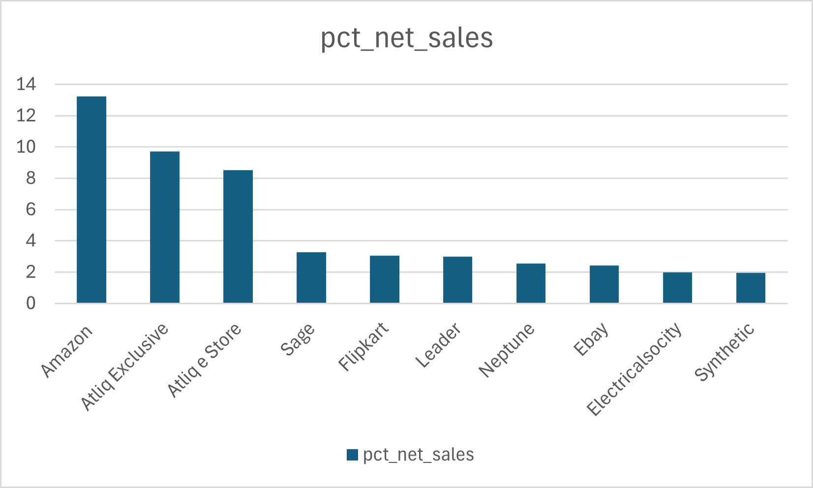

# 📊 Financial Analysis for Atliq Hardware

This project presents a comprehensive financial analysis for Atliq Hardware, a B2B tech hardware company. The analysis covers global and regional sales performance, top products/customers/markets, and the creation of reusable assets (stored procedures, SQL views, and dashboards) for long-term reporting.

---

## 📌 Problem Statements

Each module of this project is based on a business request from Atliq’s product owners or analysts:

1. **Net Sales % Share by Region**  
   Visualize customer-wise % net sales breakdown for each region (APAC, EU, LATAM, etc.).

2. **Global Net Sales Market Share**  
   Identify the top 10 markets globally by net sales % in FY2021.

3. **Top Markets, Products, and Customers**  
   Provide a ranked list of top performers in each category for FY2021.

4. **Stored Procedure for Market Badge**  
   Classify each market as "Gold" or "Silver" based on total sold quantity (>5M = Gold).

5. **Croma India Product-Level Sales Report**  
   Generate monthly product-level sales for the customer “Croma India”.

---

## 🛠️ Tools & Technologies

- **MySQL** – Advanced SQL queries, views, procedures, events, and triggers
- **Python (Pandas, Matplotlib)** – EDA and chart generation
- **Excel** – Tabular reporting and charts
- **Jira-style Screenshots** – For understanding stakeholder requirements

---

## 📂 Folder Structure

| Folder              | Contents                                                           |
|---------------------|--------------------------------------------------------------------|
| `Problem_Statement/` | Business requirements with dashboard mockups (images)             |
| `Excel_Outputs/`     | CSV files with cleaned reports (e.g., top products, net sales)    |
| `SQL_Queries/`       | Full SQL script with CTEs, triggers, events (`All_querry.sql`)    |
| `Jupyter_Notebook/`  | Python + SQL hybrid analysis notebook (`eda-sql-atliq.ipynb`)     |
| `Images/`            | Plots such as pie/bar charts for net sales and channel analysis   |

---

## 📈 Key Visualizations

### ✅ Channel Contribution (2021)


### ✅ Global Net Sales Market Share


---

## 🧠 Key Insights

- **Amazon** and **Atliq Exclusive** are global leaders in net sales %.
- **Retailer channel** contributes over **70% of gross sales**.
- **India, USA, and South Korea** are the top markets.
- Forecast accuracy can now be measured using a reusable stored procedure.

---

## 🚀 How to Use

1. Clone this repository:
```bash
git clone https://github.com/yourusername/financial-analysis-atliq-hardware.git
```

2. Explore:
   - `.sql` files for DB logic
   - `.ipynb` for data analysis and charting
   - `.csv` reports for formatted outputs

---

## 🙌 Acknowledgments

- Problem inspired by [Codebasics SQL Challenge](https://codebasics.io)
- Data is fictitious and used for educational/demo purposes only

---

## 📬 Contact

**Meet Patel**  
📧 meetpatel@email.com  
🔗 [LinkedIn](https://linkedin.com/in/yourprofile)
